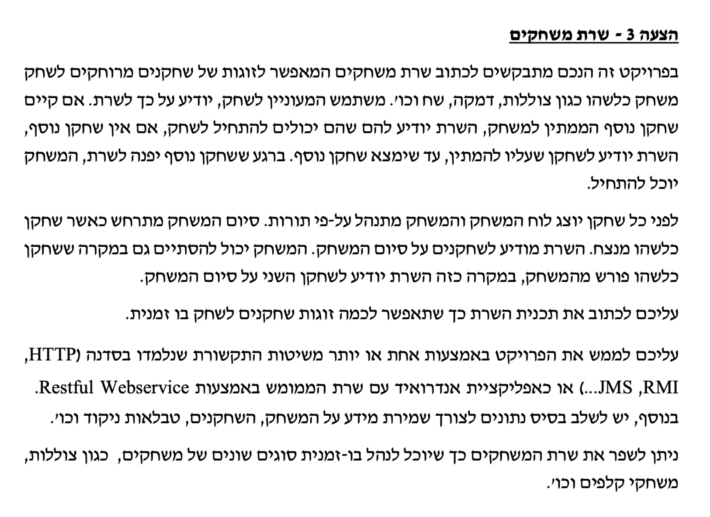
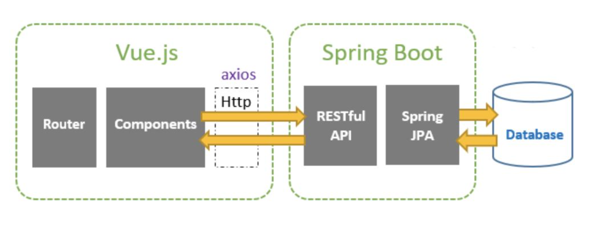
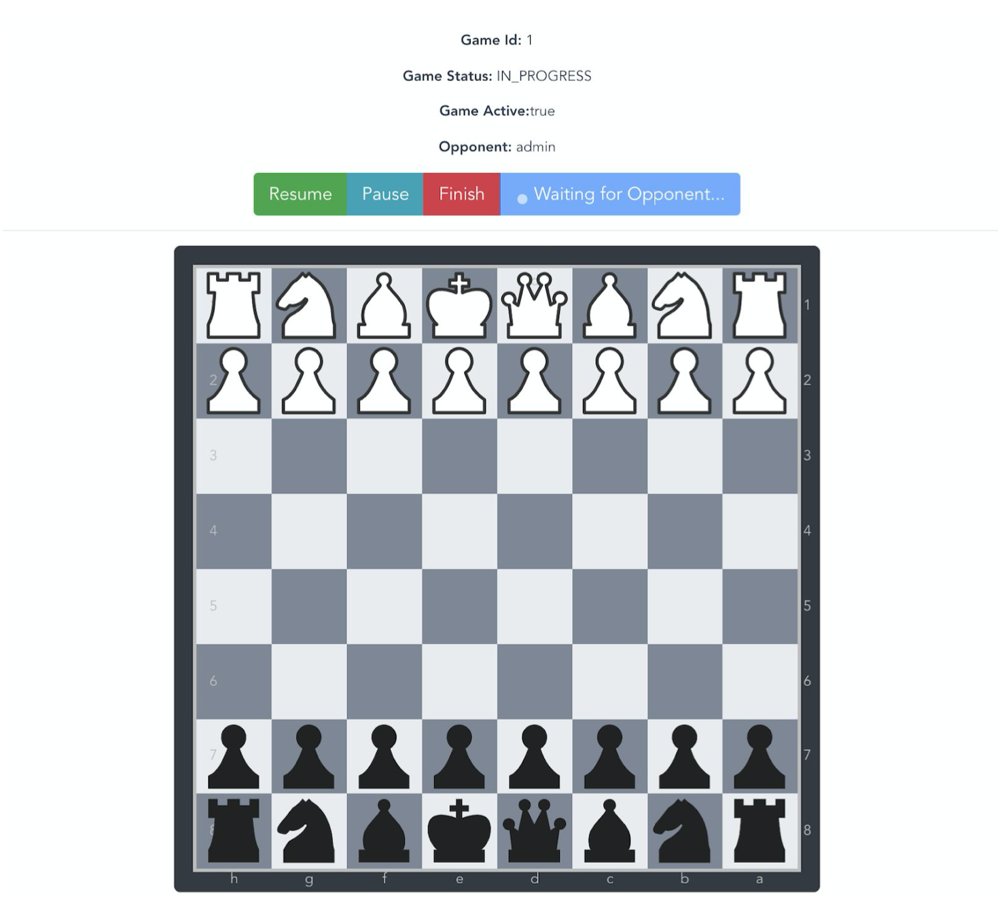
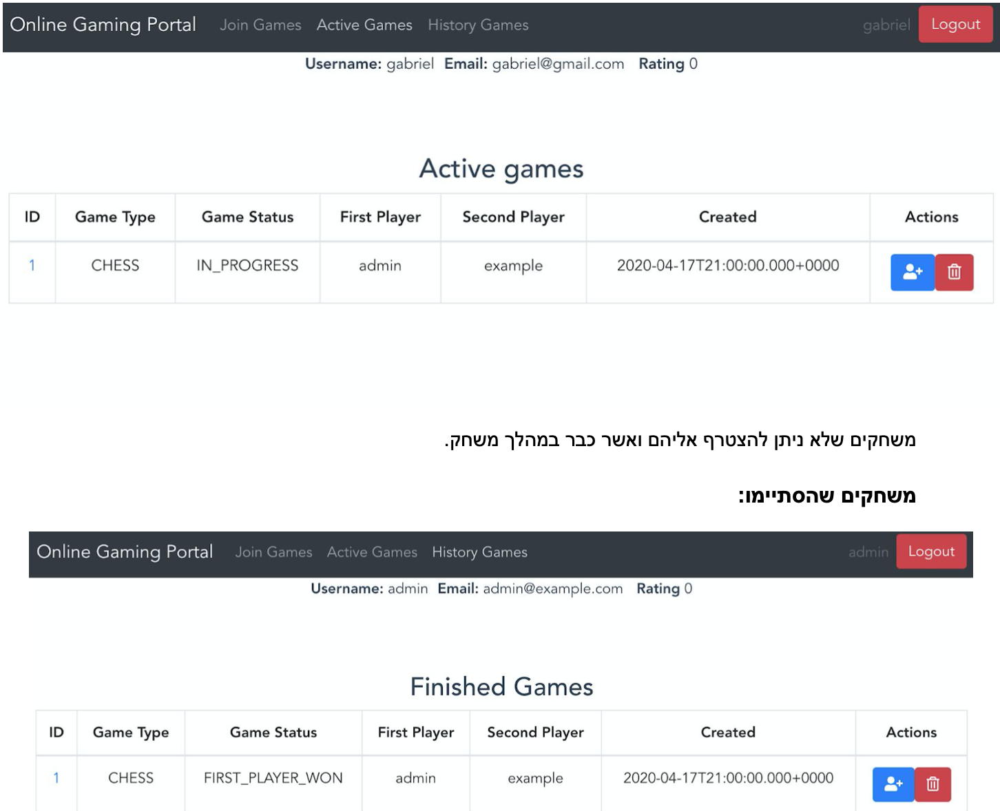
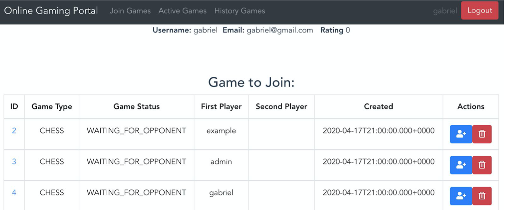
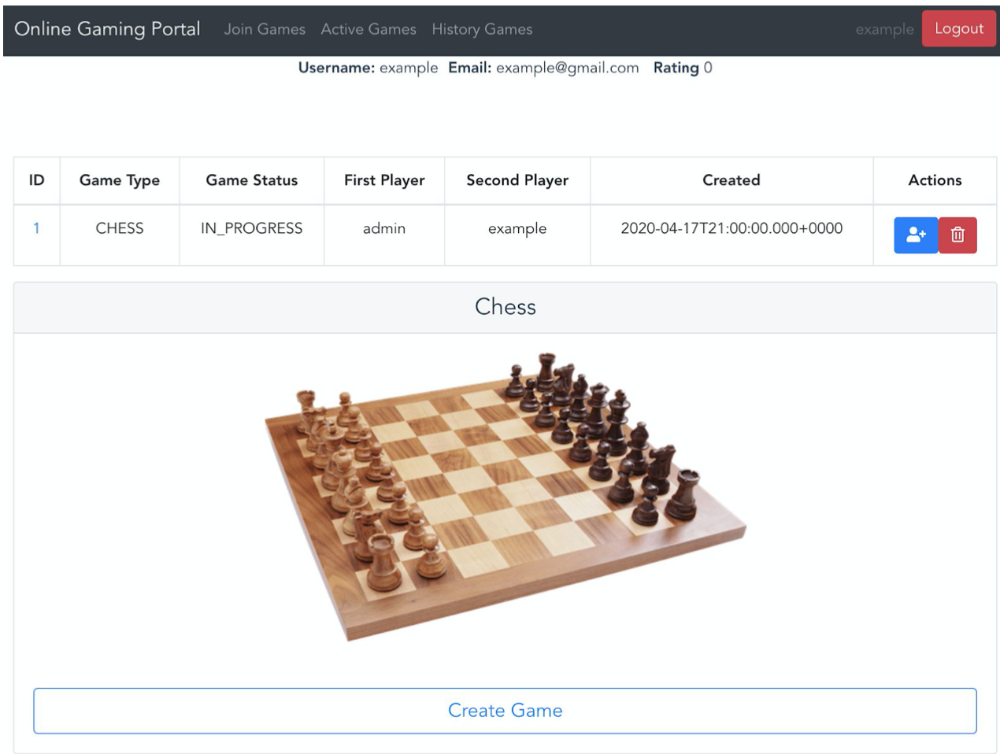
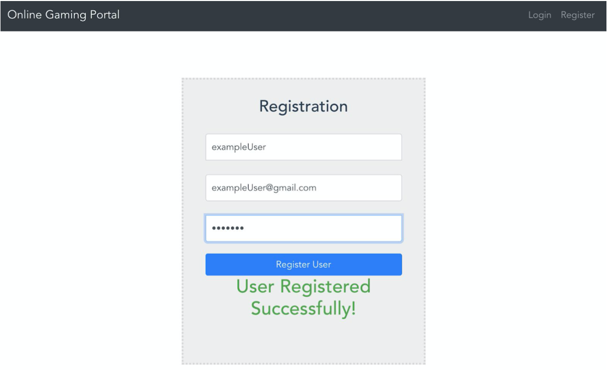
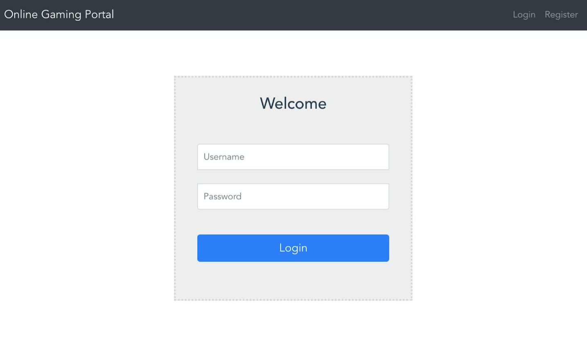
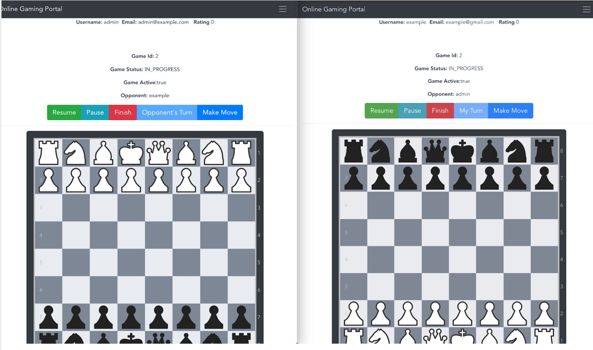

# Online Gaming Server



## Architecture



## Prerequisites

- JDK 1.8 (https://www.oracle.com/java/technologies/javase-jdk8-downloads.html)
- Apache Maven 3.6.3 (https://maven.apache.org/download.cgi)
- MySQL

## How to build project

Make sure to create an emtpy database named "gameserver" in localhost.
Configure mysql connection credentials under application.properties file to match database credentials:

```bash
spring.datasource.url=jdbc:mysql://localhost/gameserver
spring.datasource.username=root
spring.datasource.password=123456789
```

Open the project in your IDE (eclipse or intellij). Make sure maven executable is added to your PATH environment variable.
Open terminal/cmd in the same directory of the project.
Run:

```bash
mvn clean install
```

This will install all project's dependencies, build the backend and frontend module and copy/paste
the frontend Vue.js application to backend Spring Boot Application under /public folder.

## How to run project

Run inside terminal/cmd:

```bash
cd backend && mvn spring-boot:run
```

To run spring boot game server application.

### Open in your browser and visit http://localhost:8881. If page is not reached replace 'localhost' with your local ip address

## REST API - URI documentation

#### API (public permissions)

```java
    /****** /api *********/
    // /health - GET - health check route, return 200 status code if healthy, otherwise  401
    // /endpoints - GET - list of all REST API mappings in the backend
```

#### Authentication (public permission)

```java
    /****** / *********/
    // /login - POST - login a user (done by spring security)
    // /auth/register - POST - register a user
    // /auth/status - GET - return 200 status code if authenticated, otherwise 401
    // /auth/user - GET - return logged-in user, otherwise 401
```

#### User (user permissions)

```java
    /****** /api/player *********/
    // / - GET - get logged in user
    // /email/{email} - GET - get user by email
```

#### Game (user permissions)

```java
    // {gameType} - ["CHESS"]
    // {statusType} = ["WAITING_FOR_OPPONENT","IN_PROGRESS","PAUSED","FIRST_PLAYER_WON","SECOND_PLAYER_WON"]

    /******* /api/game ********/
    // /resume - GET - get logged in user's game to resume
    // /all - GET - get all games
    // /finished - GET - get all finished games
    // /status/{statusType} - GET - get all games with statusType status
    // /type/{gameType} - GET - get all games by game type
    // /{gameType}/{statusType} - GET - get all games by game type and status
    // /{gameType}/finished - GET - get all finished games by type
    // /player/{playerUsername} - GET - get all games for a specific player
    // /players/{playerUsername1}/{playerUsername2} - GET - get all games for player1 and for player2

    /******** /api/game/{gameId} *********/
    // / - GET - get game by id
    // / - DELETE - delete game by id
    // /join - POST - join game by id

    // /alive - GET - game user connectivity signal
    // /notification - GET - game notifications (opponent joined/ opponent made move / opponent resigned etc.)

    // /resume - POST - resume playing game
    // /pause - POST - pause game
    // /finish - POST - finish game
    // /resign - POST - resign from game
    // /turn - GET - return true if it's logged-in player's turn, otherwise return false

    /*******  /api/game/{gameType} ********/
    // / - GET - get all games by game type
    // /create - POST - create new game
    // /{gameId}/moves - GET - return all game moves
    // /{gameId}/move/add - POST - add move to game
```

#### Admin (admin permissions)

```java
/******* /api/admin *********/
// /api/admin/status - GET - return status code 200 if admin is authenticated, otherwise 401
// /api/admin/players - GET - return all players

/******* /api/admin/player ******/
// /{username} - GET - get player
// /{username} - DELETE - delete player
// /{username}/game - GET - get all games for player
// /{username}/game/{gameStatus} - GET - get all active games for player by status
```

## Screenshots








